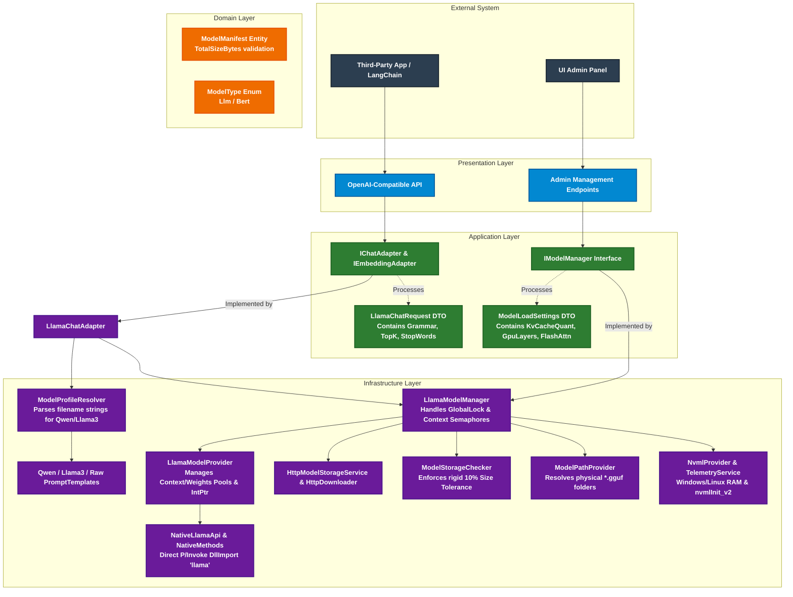

  
   
  <strong>High-Performance. Self-Hosted. Zero Setup.</strong>
   
  A lightweight .NET middleware providing a monitored, shared foundation for local AI applications.

  <a href="README.md"><b>Overview</b></a> │ 
  <a href="INSTALLATION.md"><b>Installation Guide</b></a> │ 
  <a href="DATASHEET.md"><b>Technical Data Sheet</b></a>

  
  
  
  
  

---

## What is InstantAIGate?

**InstantAIGate** is the natural next step for teams who love the flexibility of desktop AI tools (like Ollama or LM Studio) but need to bring those capabilities to a shared, highly-concurrent server environment. 

It is a ready-to-use infrastructure building block (middleware) that securely hosts local Large Language Models (LLMs) and Embeddings. Built entirely in .NET, it provides an isolated server-side runtime, a built-in administration dashboard, and a seamless OpenAI-compatible API bridge—putting total architectural control over inference back into the hands of your infrastructure team.

  

## Core Features (Foundation)

* **🔌 Drop-In OpenAI Compatibility**
  Exposes a standardized API fully compatible with the OpenAI specification. Seamlessly route existing application workflows (or LangChain agents) to your local models by simply updating the `base_url`.

* **📈 Zero-Config Observability**
  No complex metric stacks required for day-one operations. The built-in web interface provides immediate visibility into multi-GPU health, exact VRAM allocation, and real-time request queues via SignalR streams.

* **⚙️ High-Density Hardware Control**
  Extract absolute maximum throughput from a single bare-metal server. Explicitly map LLM computational layers between GPU and CPU, and enforce physical memory locking (`mlock`) to guarantee zero system swap latency spikes.

* **🔄 Dynamic Weight Pooling & Hot-Swap**
  Manage highly concurrent workflows across your team. Host embedding models (like BGE-M3) and conversational layers (like Qwen) simultaneously. Hot-swap multi-gigabyte models on the fly via REST API or the Web UI without dropping active client connections.

* **📦 Zero Python Dependency (.NET Native)**
  Built purely in modern C# and compiled as a standalone binary. Bypass complex virtual environments, dependency hell, and Python runtime overhead. Predictable deployment for both Windows and Linux servers.

## Technical Architecture & High-Level Design

**InstantAIGate** is built on **Domain-Driven Design (DDD)** principles, cleanly separating core business logic from infrastructural details. The architecture ensures modularity, testability, and high native performance. 

The core interaction identifier is the **RepoId** (e.g., `"Qwen/Qwen2.5-7B-Instruct-GGUF"`). The presentation layer and external APIs remain entirely agnostic of physical disk paths, file extensions, or underlying C++ bindings.

| Layer | Responsibility | Key Components |
|-------|----------------|----------------|
| **Presentation / API** | Enables fast integration with minimal app changes. Provides real-time SSE updates for dashboards. | OpenAI-compatible REST endpoints, Admin API, SignalR Hubs. |
| **Application** | Orchestrates model lifecycle, hot-swapping, and resource pooling. Encapsulates routing policies. | ChatCompletionService, ModelManager, PromptTemplateService. |
| **Domain / Contracts** | Preserves business invariants, model identity, and auditable manifests. | ModelManifest, RepoId, ModelFile. |
| **Infrastructure** | Delivers highly observable native execution. Manages P/Invoke boundaries, physical storage, and raw OS telemetry. | LlamaModelProvider, NativeLibraryLoader, NvmlProvider, HttpModelStorageService. |

## 🛠️ Tech Stack & Third-Party Licenses

InstantAIGate is built using modern, robust technologies on both the backend and frontend:

* **LLM Engine:** [llama.cpp](https://github.com/ggerganov/llama.cpp) (Native integration and drivers for high-performance GGUF inference)
* **Backend:** Modern .NET, ASP.NET Core, OpenAI .NET Client, [SharpCompress](https://github.com/adamhathcock/sharpcompress) (for on-the-fly native library extraction)
* **Frontend:** Vanilla JS, Bootstrap Icons, SignalR

⚖️ <b>View Third-Party License Information</b>

This project complies with all open-source licenses of its dependencies. 
Major dependencies, including **llama.cpp**, use permissive licenses such as **MIT** and **Apache 2.0**.

For the full, detailed list of third-party components, verification sources, and copyright notices, please refer to our dedicated [THIRD-PARTY-NOTICES.md](./THIRD-PARTY-NOTICES.md) file.

## 📄 License & Trademark
Copyright (c) 2026 Instancium™ (https://instancium.com). All rights reserved.

This project is licensed under the **Apache License 2.0** - see the [LICENSE](LICENSE.txt) file for details.

### Branding & Logo Trademark

The **InstantAIGate** name, logos, and all branding assets located in any `media` directories are not covered by the Apache 2.0 license. 
Instead, all branding materials and logos throughout the project are licensed under the [Creative Commons Attribution-NonCommercial-NoDerivatives 4.0 International (CC BY-NC-ND 4.0)](https://creativecommons.org/licenses/by-nc-nd/4.0/).

You are welcome to use the logo to refer to this project, but you may not modify it or use it for commercial purposes or in a way that implies official endorsement without explicit permission.
