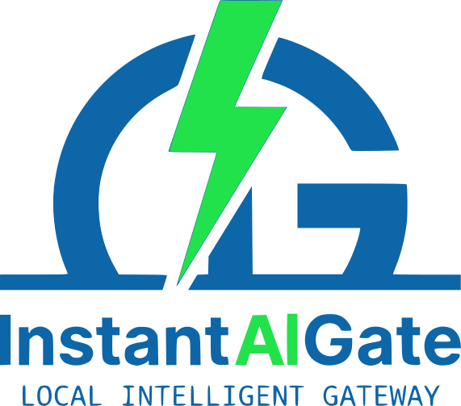

  

# 🚀 InstantAIGate: Enterprise AI Ecosystem

> **Manifesto: Product Evolution (From Monolith to Ecosystem)**
> InstantAIGate is moving to a fundamentally new architectural level. We are transitioning from a monolithic structure (v1.x, GGUF) to a distributed, microservice-based ecosystem built natively for **ONNX** (with extensibility via plugins). This transformation solves scaling bottlenecks, allowing us to deploy independent nodes for text generation, computer vision, and complex analytical RAG pipelines without overloading the system core.

## 🏗 System Architecture

The system is built on microservice architecture and clean code principles. Each module serves a strict, single purpose and can be scaled independently:

### 1. Entry Point (API Gateway)

* **`InstantAIGate.Proxy`**: A lightweight, "smart" gateway. It does *not* load neural networks. It handles request routing, load balancing (Round-Robin), authentication (API Keys/JWT), rate limiting, and telemetry/billing.

### 2. Compute Nodes (Inference & Pipelines)

* **`InstantAIGate.Chat`**: The inference engine for text (LLM) and multimodal (VLM) models. It fully emulates the **OpenAI API** standard. Supports running multiple worker instances to distribute high loads seamlessly.
* **`InstantAIGate.Flow`**: The analytical hub and pipeline orchestrator. Handles the heavy lifting: document parsing (PDF/Word), chunking, **GraphRAG**, vector search, and inference for specialized computer vision models (YOLO, PaddleOCR).

### 3. Core & Model Plugins (Strategy Pattern)

* **`InstantAIGate.Core`**: A shared contracts library. Contains only lightweight DTOs (Data Transfer Objects), interfaces (e.g., `IInferenceEngine`), and common exceptions. **Zero business logic.**
* **`InstantAIGate.Runners.*`**: Isolated model loader implementations.
* `InstantAIGate.Runners.Onnx` — ONNX Runtime based inference engine.
* *(Planned)* `InstantAIGate.Runners.Gguf` — Inference engine for LlamaSharp.
* The Chat server knows nothing about the underlying model formats; it interacts with them strictly through abstract interfaces from `Core`.

### 4. User Interfaces (Micro-frontends)

* **`InstantAIGate.UI.*`**: A suite of independent visual portals (`UI.Chat`, `UI.Telemetry`, `UI.Admin`).
* *Standalone Mode:* Can connect directly to `Chat` or `Flow` for quick local development and testing.
* *Enterprise Mode:* Routed through the single entry point, `InstantAIGate.Proxy`, for corporate access control and unified security.

---

## 🗺 Roadmap — Version 2.0 (ONNX Branch)

Development is divided into logical phases. The current focus is on building the foundational framework.

### 🟡 Phase 1: Foundation & Inference (Current)

* [ ] Create `InstantAIGate.Core` library (DTOs, `IInferenceEngine` interface).
* [ ] Implement the isolated `InstantAIGate.Runners.Onnx` module.
* [ ] Develop `InstantAIGate.Chat` with basic text generation support (OpenAI `/v1/chat/completions` emulation).
* [ ] Containerize (Docker) the Chat core.

### ⚪ Phase 2: Gateway & Security

* [ ] Develop `InstantAIGate.Proxy` (based on YARP or similar reverse proxy).
* [ ] Implement the authentication system (API keys).
* [ ] Configure load balancing to route traffic across multiple `InstantAIGate.Chat` instances.
* [ ] Add Rate Limiting.

### ⚪ Phase 3: Data Analytics & RAG (Flow)

* [ ] Develop the `InstantAIGate.Flow` service.
* [ ] Integrate ONNX embedding models for text vectorization.
* [ ] Implement complex file processing pipelines (PDF, CSV).
* [ ] Build the pipeline for GraphRAG / classical RAG.
* [ ] Integrate YOLO / PaddleOCR for image processing pipelines.

### ⚪ Phase 4: UI Ecosystem (Micro-frontends)

* [ ] Build the core `InstantAIGate.UI.Chat` application.
* [ ] Create the `InstantAIGate.UI.Admin` dashboard to view Proxy telemetry.
* [ ] Unify UIs into a single enterprise portal.

---

**How to join or get started:**
*All active development of the new architecture is currently happening in the `onnx` branch. The `main` branch temporarily holds the stable (legacy) GGUF monolith.*

---

## 📄 License & Trademark
Copyright (c) 2026 Instancium™ (https://instancium.com). All rights reserved.

This project is licensed under the **Apache License 2.0** - see the [LICENSE](LICENSE.txt) file for details.

### Branding & Logo Trademark

The **InstantAIGate** name, logos, and all branding assets located in any `media` directories are not covered by the Apache 2.0 license. 
Instead, all branding materials and logos throughout the project are licensed under the [Creative Commons Attribution-NonCommercial-NoDerivatives 4.0 International (CC BY-NC-ND 4.0)](https://creativecommons.org/licenses/by-nc-nd/4.0/).

You are welcome to use the logo to refer to this project, but you may not modify it or use it for commercial purposes or in a way that implies official endorsement without explicit permission.
