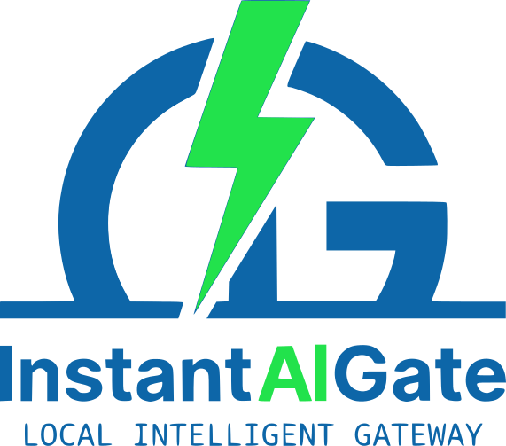
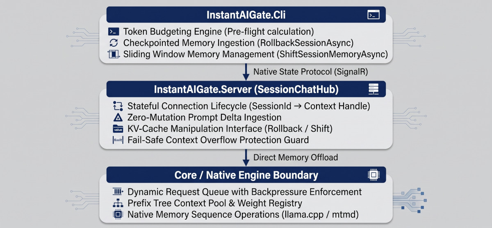

  

  
  
  
  

**InstantAIGate** is a high-throughput, deterministic AI inference gateway developed by **Instancium**, an independent R&D laboratory. Engineered as the laboratory's foundational platform for powering next-generation sovereign applications and intelligent systems, it delivers a compiled, cross-platform **.NET 10** architecture with direct native memory bindings to inference engines, establishing **Architectural Autonomy** and **Structural Resilience**.

By serving as the laboratory's core inference gateway, InstantAIGate enables Instancium's ecosystem and downstream applications to orchestrate local models within a **Controlled Data Perimeter**. This foundation empowers engineering teams and enterprises to deploy production-grade AI solutions without forced dependencies on proprietary cloud APIs, guaranteeing **Vendor Independence** and uncompromised **Digital Subjectivity**.

---

### The Philosophy: Controlled AI Context
> **Context. State. Memory. Control.**

Unlike conventional stateless proxies that silently compress, truncate, or inject hidden prompts behind your back, InstantAIGate operates as a **stateful inference orchestration gateway**. It anchors active inference sessions directly to physical hardware resources in GPU VRAM, giving the developer absolute ownership over raw, untampered context.

Cloud APIs often rely on opaque server-side mitigations—hidden sliding windows, lossy token summarization, and unseen system prefixes—that cause critical context drift, attention loss, and silent hallucinations. InstantAIGate rejects invisible optimizations:
* **Zero Silent Truncation:** What you send is exactly what resides in memory. No silent pruning, no surprise drops.
* **Hallucination & Drift Mitigation:** By strictly controlling KV-cache checkpoints and token boundaries, applications prevent attention degradation and maintain deterministic reasoning across long multi-turn sessions.
* **True State Transparency:** Clients gain direct visibility into exact token counts, physical cache reservations, and state shifts.

You cannot control an intelligence if you do not control its memory. InstantAIGate provides the raw primitives to manage conversational state explicitly, reliably, and deterministically.

## Key Features

### 1. Direct KV-Cache Control & Manipulation
Gain deterministic programmatic control over the physical KV cache allocated in GPU VRAM:
- **Prefix Checkpointing (`RollbackSession`):** Instant rollback to fixed token boundaries without re-evaluating preceding prefixes.
- **Selective Sequence Shifting (`ShiftSessionCache`):** Sliding window operations in native memory. Excise intermediate turns while preserving system prompts and visual projection tokens.
- **Prefix Tree Context Pooling:** Maximize throughput by reusing shared token prefixes across concurrent sessions.

### 2. Zero-Mutation Policy & Fail-Safe Guard
Strict memory management ensures reliability:
- The gateway *never* silently truncates or summarizes session context.
- **Fail-Safe Guard:** Validates token capacity *before* native decoding routines are called. If capacity is exceeded, it halts execution and throws a `ContextOverflowException`, preventing memory corruption and engine crashes.

### 3. Native State Protocol (SignalR)
High-performance, full-duplex transport (`/hub/chat`):
- **Incremental Delta Transmission:** Transmit only latest prompt deltas, minimizing payload size.
- **Session Persistence:** Context handles remain leased in VRAM across turns for minimal Time-To-First-Token (TTFT).
- **Single-Pass Media Tokenization:** Image embeddings are computed once and pinned in the KV cache, enabling multi-turn conversations without repeated binary transfers.

### 4. Real-Time Observability & Telemetry
Dedicated, secure telemetry hub (`/hub/telemetry`) streaming high-fidelity data at 1Hz:
- VRAM context leases and request queue backpressure (`InferenceMetrics`).
- Live server-side download progress.
- Native C++ `stderr` interception piped directly to SignalR clients.

## Architecture

InstantAIGate is designed around a decoupled, stateful architecture that isolates client orchestration from the gateway server and underlying native execution backends.

  

### System Layers

#### A. Client Layer: Universal Integration (CLI as Reference Client)
The inference gateway exposes a full-duplex, event-driven API. Any environment capable of establishing a WebSocket / SignalR connection can natively integrate with InstantAIGate:
- **Language Agnostic:** Seamless integration via official SignalR client libraries for **JavaScript / TypeScript** (browsers, Node.js, Electron), **Python**, **Go**, **Rust**, and **.NET / C#**.
- **InstantAIGate.Cli (Reference Implementation):** An included open-source reference client demonstrating how consumers can implement token budgeting, checkpointed ingestion (`RollbackSessionAsync`), sliding-window memory management (`ShiftSessionMemoryAsync`), and interactive streaming.

#### B. Gateway Core: InstantAIGate.Server (`SessionChatHub`)
The actual inference gateway runtime. It manages high-concurrency client sessions and coordinates stateful interactions without mutating context:
- **Stateful Connection Lifecycle:** Maps transient client connection IDs and persistent `SessionId` tokens directly to leased native memory handles (`Context Handle`).
- **Zero-Mutation Delta Ingestion:** Ingests only conversational deltas while maintaining strict prompt integrity.
- **KV-Cache Manipulation Interface:** Directly executes prefix rollback and sequence shift primitives on the host.
- **Fail-Safe Guard:** Intercepts out-of-budget contexts *before* dispatch to native routines, protecting hardware from crashes.

#### C. Native Engine Boundary
The low-level C++ boundary executing hardware-accelerated tensor operations:
- **Dynamic Backpressure Queue:** Prioritizes and throttles requests across active sessions to prevent VRAM saturation.
- **Prefix Tree Context Pool:** Reuses shared prefix token graphs and model weights across multi-tenant inference sessions.
- **Native Memory Operations:** Interacts directly with compiled `llama.cpp` / `mtmd` runtimes for direct hardware offload without runtime virtualization overhead.

### Hardware Acceleration & Cross-Platform Execution

Powered by `llama.cpp` with native Vulkan backend integration, InstantAIGate breaks free from vendor lock-in. It delivers hardware-accelerated LLM/VLM inference across a vast spectrum of consumer and enterprise GPUs without requiring heavy proprietary stacks like CUDA:
- **NVIDIA GPUs:** GeForce, Quadro, Tesla (via Vulkan ICD)
- **AMD Radeon GPUs:** RX series, Vega, RDNA architectures
- **Intel Arc & Integrated Graphics:** Xe architecture
- **Apple Silicon:** via cross-compilation and Metal-Vulkan translation layers where applicable
- **Cross-Environment:** Seamless execution on Windows, Linux, and edge devices within your private network perimeter.

## 📄 License & Trademark
Copyright (c) 2026 Instancium™ (https://instancium.com). All rights reserved.

This project is licensed under the **Apache License 2.0** - see the [LICENSE](LICENSE.txt) file for details.

### Branding & Logo Trademark

The **InstantAIGate** name, logos, and all branding assets located in any `media` directories are not covered by the Apache 2.0 license. 
Instead, all branding materials and logos throughout the project are licensed under the [Creative Commons Attribution-NonCommercial-NoDerivatives 4.0 International (CC BY-NC-ND 4.0)](https://creativecommons.org/licenses/by-nc-nd/4.0/).